# QUBES-SNITCH

Qubes-Snitch is a minimalistic Qubes OS gateway firewall management tool that reacts to connection attempts and DNS resolve attempts from VMs network-chained behind its own VM.

Similar to OpenSnitch or Little Snitch, but much more lightweight, it lets you permanently allow or reject these attempts from a simple prompt. Decisions are stored in YAML files and turned into nftables rules after reboots (when the daemon starts via its systemd service). YAML files can also be manually created to pre-define allow and reject rules.

Qubes-Snitch is designed to replace the default sys-firewall VM in Qubes OS (you can name it sys-snitch for example). The advantage is that connection attempts can be allowed or rejected interactively while they happen, which makes for a much more simple, fast and secure firewall setup than using `qvm-firewall` commands or the Qubes OS Firewall GUI, where you have to know which connections you want to allow before they happen, which often requires tcpdump or Wireshark.

## Screenshot

`qubes-snitch` in front of a `signal-desktop` VM:

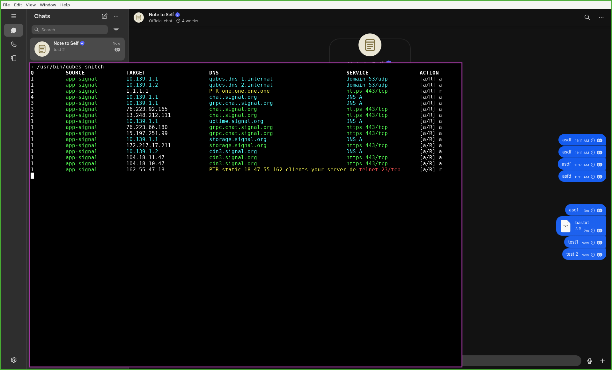

## Prompt Columns and Colors

Qubes-Snitch colors are scan hints only. Always read all columns before deciding to allow or reject.

At the prompt, press `a` to allow or `r` to reject. The uppercase letter in `[a/R]` is the default if you press Enter.

### Columns

- `Q`: pending question count, terminal default color
- `SOURCE`: VM that created the traffic, colored with the VM's Qubes label color
- `TARGET`: IP being contacted
- `DNS`: resolver name, queried name, DNS-cache name, PTR name, or `no PTR`
- `SERVICE`: protocol/port or DNS query type
- `ACTION`: available decision keys and optional typed answer, terminal default color

### Color Rules

- Normal IP traffic keeps `TARGET` in the terminal default color, because an IP alone is not good or bad
- DNS-cache names are green. This means the VM asked DNS for this name, and then connected to an IP returned for that name
- PTR-only names are yellow and shown as `PTR name`. This means Qubes-Snitch did not see a matching DNS request from the VM, but reverse DNS for the IP returned a name
- Missing DNS/PTR names are red and shown as `no PTR`. This means Qubes-Snitch has no readable name for the IP from the DNS cache, and no PTR record exists for this IP
- Normal services use `prompt_protocol_colors` from `config.yml`: encrypted is green, unencrypted is yellow, unlisted is red
- Service names and colors are labels only. Allowing `https 443/tcp` allows TCP port 443 traffic; Qubes-Snitch does not verify TLS, HTTP, QUIC, SNI, certificates, or application payloads
- DNS traffic (53/udp) to Qubes OS internal resolvers is blue across `TARGET`, `DNS`, and `SERVICE`
- DNS traffic (53/udp) to any other resolver is red across `TARGET`, `DNS`, and `SERVICE`, because it bypasses the expected Qubes DNS path

Qubes OS internal DNS names are hardcoded in Qubes-Snitch:

- `10.139.1.1` -> `qubes.dns-1.internal`
- `10.139.1.2` -> `qubes.dns-2.internal`

### Color Examples

`signal` wants to connect to Qubes OS internal DNS server `10.139.1.1` (`qubes.dns-1.internal`) on `domain 53/udp`, so `TARGET`, `DNS`, and `SERVICE` are blue.


`signal` wants to connect to Qubes OS internal DNS server `10.139.1.2` (`qubes.dns-2.internal`) on `domain 53/udp`, so `TARGET`, `DNS`, and `SERVICE` are blue.

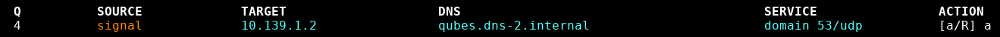

`signal` wants to connect to external DNS server `8.8.8.8` (`dns.google`) on `domain 53/udp`, so `TARGET`, `DNS`, and `SERVICE` are red.

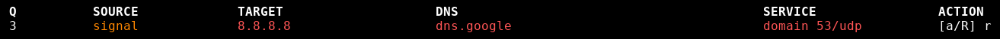

`signal` wants to ask Qubes OS internal DNS server `10.139.1.1` for `_https._tcp.updates.signal.org` with query type `DNS SRV`, so `TARGET`, `DNS`, and `SERVICE` are blue.

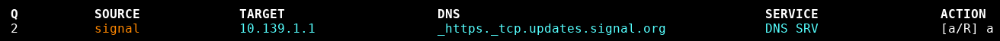

`signal` wants to ask Qubes OS internal DNS server `10.139.1.2` for `updates.signal.org` with query type `DNS A`, so `TARGET`, `DNS`, and `SERVICE` are blue.

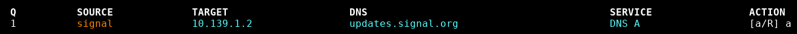

`signal` wants to connect to `104.18.2.166`; Qubes-Snitch has a DNS-cache match for `updates.signal.org`, and `https 443/tcp` is listed as encrypted, so `DNS` and `SERVICE` are green while `TARGET` stays in the terminal default color.

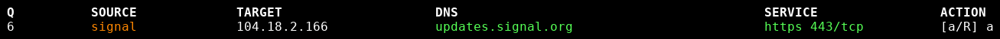

`signal` wants to connect to `151.101.2.132`; Qubes-Snitch has a DNS-cache match for `deb.debian.org`, but `http 80/tcp` is listed as unencrypted, so `DNS` is green and `SERVICE` is yellow while `TARGET` stays in the terminal default color.

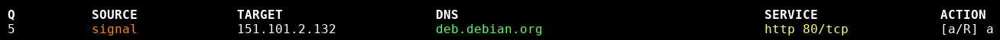

`signal` wants to connect to `203.0.113.10`; Qubes-Snitch only has PTR name `mail.example.com`, so `DNS` is yellow. `imaps 993/tcp` is listed as encrypted, so `SERVICE` is green while `TARGET` stays in the terminal default color.

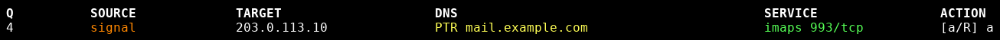

`signal` wants to connect to `193.174.160.18`; Qubes-Snitch has no DNS-cache match and no PTR record, so `DNS` shows red `no PTR`. `https 443/tcp` is listed as encrypted, so `SERVICE` is green while `TARGET` stays in the terminal default color.

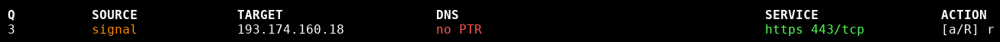

`signal` wants to connect to `198.51.100.23`; Qubes-Snitch has no DNS-cache match and no PTR record, and `telnet 23/tcp` is unlisted in `prompt_protocol_colors`, so `DNS` and `SERVICE` are red while `TARGET` stays in the terminal default color.

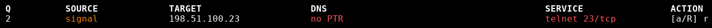

`signal` wants to connect to `198.51.100.77`; Qubes-Snitch has no DNS-cache match and no PTR record, and `31337/tcp` is not in `/etc/services` or `prompt_protocol_colors`, so `DNS` and `SERVICE` are red while `TARGET` stays in the terminal default color.

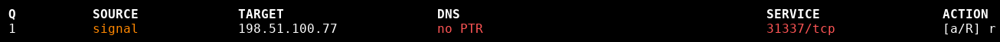

## Installation

Run the following commands in dom0 to download the installer through a DisposableVM:

```sh
# Download the qubes-snitch dom0 installer and copy it to dom0
qvm-run --dispvm --pass-io --no-gui --user user -- \
  'curl -fsSL https://raw.githubusercontent.com/kuhbs/qubes-snitch/main/install-dom0.sh' \
  > install-dom0.sh

# Read the dom0 installer source first
less install-dom0.sh
```

The dom0 installer clones the current repository into `tpl-qubes-snitch` and runs that checkout's `install.sh` as root inside the template. If you need a pinned supply-chain review, review or pin the cloned repository contents too, not only this wrapper script.

The installer creates `tpl-qubes-snitch` and `sys-snitch`, installs Qubes-Snitch into the template, installs the dom0 `qubes.SnitchSources` qrexec service, and enables the required Qubes ProxyVM services:

```
# Make the installer executable
chmod 700 install-dom0.sh

# Run the installer
./install-dom0.sh
```

The qvm-services `qubes-network` and `qubes-firewall` are enabled for sys-snitch because Qubes owns the safe ProxyVM plumbing (makes network traffic more secure). Qubes-Snitch adds the interactive allow/reject policy layer on top.

After the installer finishes, choose the upstream network for `sys-snitch`, start it, and route one VM through it first:

```sh
# Attach sys-snitch "to the internet"
qvm-prefs sys-snitch netvm sys-net

# Start sys-snitch
qvm-start sys-snitch

# Attach a VM behind sys-snitch
qvm-prefs <my-vm> netvm sys-snitch
```

## First Use

Start `sys-snitch` and use tools and programs that generate internet traffic in VMs that have `sys-snitch` as their NetVM. The `qubes-snitchd` systemd service runs all the time in `sys-snitch`. When traffic appears for which there were no rules created previously, it sends a desktop notification from `sys-snitch`.

The notification only tells you that traffic is waiting for a decision. To allow or reject it, open a terminal in `sys-snitch` as user (no root required) and run:

```sh
qubes-snitch
```

## Saved Decisions

Decisions are persistent for normal VMs and purpose-specific DispVM bases. Qubes-Snitch writes allow/reject rules under `/rw/usrlocal/qubes-snitch/rules/<source>.yml`, reloads nftables, and does not ask again for the same saved decision. To remove a saved rule, you have to manually edit the matching YAML file and then run the following command as root in `sys-snitch`:

```sh
systemctl restart qubes-snitchd.service
```

DNS decisions are shown by domain when regular UDP DNS queries are detected. The connection to the DNS server itself is still a network decision too, so DNS can ask twice: once for the resolver connection, and then again for the domain. DNS-over-TCP is only a normal TCP/53 network decision; reject TCP/53 if you do not want clients to use it.

When a DNS domain question has no saved rule yet, Qubes-Snitch queues the prompt and rejects that one packet instead of answering DNS `REFUSED`. The client sees normal UDP loss. If you allow the domain before the client retries, the retry reaches the resolver. For allowed A rules, Qubes-Snitch also performs its own resolver lookup to populate the TTL-based display cache.

```text
Q          SOURCE             TARGET                    DNS                                        SERVICE                ACTION
2          browser            10.139.1.1                qubes.dns-1.internal                       domain 53/udp          [a/R] a
1          browser            10.139.1.1                example.org                                DNS A                  [a/R] a
```

DNS is complex: the protocol has many record types, classes, opcodes, optional sections, DNSSEC records, EDNS, uncommon compatibility behavior, and malformed packets from broken software. Qubes-Snitch deliberately does not try to be a full DNS firewall. It uses a small whitelist of supported client questions and rejects everything else before it can become policy.

Supported DNS questions must be UDP/53, no more than 1232 bytes, opcode QUERY, class IN, exactly one question, no answer/authority/real additional sections, EDNS with at most one OPT pseudo-record, a normal ASCII domain name, and one of these exact qtype names: A, CNAME, MX, TXT, SRV, PTR, CAA, NS, SOA, HTTPS, SVCB, NAPTR, DS, DNSKEY, RRSIG, NSEC, NSEC3. One EDNS OPT record may contain multiple EDNS options. Live AAAA questions get REFUSED without prompt because Qubes-Snitch is IPv4-only. ANY, AXFR, IXFR, non-IN classes, unknown qtypes, generic qtype aliases such as `TYPE1`, numeric qtypes, invalid names, oversized DNS bodies, multi-question packets, multiple EDNS OPT records, and malformed DNS are rejected without YAML rules.

For new supported DNS questions with no rule, Qubes-Snitch rejects the current queued packet with the NFQUEUE drop verdict, queues a prompt, and lets the client retry naturally after the rule is saved. It does not synthesize successful DNS answers. Resolver replies are not parsed. After an A rule is allowed, Qubes-Snitch does its own A lookup through `/etc/resolv.conf` and stores the result as a RAM-only display hint keyed by source VM and answer IP.

This cache is only a display hint for later network prompts. If `browser` allowed `turn.cloudflare.com A` and Qubes-Snitch's own lookup returned `141.101.90.1`, then a later connection to `141.101.90.1` can show `turn.cloudflare.com` in the `DNS` column.

The saved rule still uses the IP address, protocol and port. Qubes-Snitch never writes hostnames into nftables matching rules:

```yaml
rules4:
  - ptr: turn.cloudflare.com
    dest: 141.101.90.1
    proto: tcp
    port: "443"
    action: allow
```

The DNS hint cache is scoped per source VM so one VM's DNS lookup does not label another VM's traffic. It is not used to auto-allow traffic or to match rules. If the cache has no fresh TTL-valid answer for a destination IP and no PTR record exists, `DNS` falls back to `no PTR`.

## Manually Creating Firewall Rules

Rules live in the network-providing AppVM/ProxyVM `sys-snitch:/rw/usrlocal/qubes-snitch/rules/`. Each source has its own file named after the source, for example `sys-snitch:/rw/usrlocal/qubes-snitch/rules/browser.yml`.

Rules are checked from top to bottom. Put specific rejects before broad allows.

`ptr` is a human-readable note. Qubes-Snitch writes the known destination name there when it creates a rule, but matching only uses `dest`, `proto`, and `port`.

Use `any` for all destinations or all ports. Destinations may also be one IP or one CIDR network. TCP/UDP ports must be quoted strings: numbers like `"443"`, numeric ranges like `"8000-8999"`, `"any"`, or names from `/etc/services`, including hyphenated names such as `"domain-s"`. Protocols must be written as names: `tcp`, `udp`, or `icmp`. Numeric protocol strings such as `"6"`, `"17"`, `"06"`, or `"99"` are rejected.

ICMP rules currently match ICMP as a protocol only. Qubes-Snitch does not distinguish ICMP type/code, so allowing ICMP allows all ICMP to the matching destination.

To reject any of the following, change `allow` to `reject`. The rule language is only `allow` or `reject`; it does not have a separate silent-deny action.

Examples:

```yaml
rules4:

  # One IPv4 address and one named port from /etc/services
  - ptr: any
    dest: 93.184.216.34
    proto: tcp
    port: "https"
    action: allow

  # One IPv4 subnet and one numeric port
  - ptr: any
    dest: 93.184.216.0/24
    proto: tcp
    port: "443"
    action: allow

  # One IPv4 address and one numeric port range
  - ptr: any
    dest: 93.184.216.34
    proto: tcp
    port: "8000-8999"
    action: allow
```

To allow all TCP, UDP, and ICMP IPv4 traffic:

```yaml
rules4:

  # Allow all TCP traffic
  - ptr: any
    dest: any
    proto: tcp
    port: "any"
    action: allow

  # Allow all UDP traffic
  - ptr: any
    dest: any
    proto: udp
    port: "any"
    action: allow

  # Allow all ICMP traffic
  - ptr: any
    dest: any
    proto: icmp
    port: "any"
    action: allow
```

To allow DNS queries, add entries under `dns`. Use a normal DNS name for an exact match. Prefix a DNS name with `*.` to match subdomains below that suffix. `"*.example.org"` matches `www.example.org` but not the bare apex `example.org`; add a separate `example.org` rule if you want the apex too. Manual DNS rules may only use the exact supported qtype names above; aliases such as `TYPE1`, numeric qtypes, and `AAAA` are rejected. Qubes-Snitch does not support IPv6 traffic, so live DNS `AAAA` questions get a DNS `REFUSED` response and manual DNS rules must not use `AAAA`:

```yaml
dns:

  # One normal domain
  - qname: example.org
    qtype: A
    action: allow

  # One wildcard domain suffix
  - qname: "*.example.org"
    qtype: A
    action: allow

  # Mail lookup
  - qname: example.org
    qtype: MX
    action: allow

  # SIP/service discovery
  - qname: _sip._udp.example.org
    qtype: SRV
    action: allow
```

Note that both relevant sections, `rules4` and `dns`, have to be defined or the `qubes-snitchd` daemon will abort with a config error. If you do not use a section, define it as an empty list (`[]`).

YAML has special unquoted scalar values. Words such as `no`, `yes`, `true`, `false`, `null`, and numbers may be parsed as booleans, null, or integers instead of strings. Quote DNS names, wildcard rules, and every `port`, for example `qname: "*.example.org"` and `port: "443"`. Qubes-Snitch validates loaded YAML strictly and aborts instead of silently converting bad policy.

Qubes-Snitch supports IPv4 rule sections only. Extra address-family rule sections are not supported.

## Viewing Rejected Packets and DNS Queries

To view all Qubes-Snitch reject logs live, including rejected packets and rejected DNS queries run the following commands as root in `sys-snitch`:

```sh
journalctl -f -g QUBES-SNITCH
```

To view only nftables/kernel packet reject logs:

```sh
journalctl -k -f -g QUBES-SNITCH
```

Packet reject logs are emitted by nftables and look like this:

```text
# Rejected ICMP packet to 1.2.3.4
Jun 14 19:52:50 sys-snitch kernel: QUBES-SNITCH browser reject IN=vif17.0 OUT=eth0 MAC=fe:ff:ff:ff:ff:ff:00:16:3e:5e:6c:00:08:00 SRC=10.137.0.42 DST=1.2.3.4 LEN=84 TOS=0x00 PREC=0x00 TTL=63 ID=636 DF PROTO=ICMP TYPE=8 CODE=0 ID=50804 SEQ=6

# Rejected HTTPS packet
Jun 14 19:54:48 sys-snitch kernel: QUBES-SNITCH browser reject IN=vif17.0 OUT=eth0 MAC=fe:ff:ff:ff:ff:ff:00:16:3e:5e:6c:00:08:00 SRC=10.137.0.42 DST=162.55.47.18 LEN=52 TOS=0x00 PREC=0x00 TTL=63 ID=26953 DF PROTO=TCP SPT=48820 DPT=443 WINDOW=64240 RES=0x00 SYN URGP=0
```

Rejected DNS queries are logged by `qubes-snitchd` because DNS rejects are answered locally instead of being rejected by nftables. They look like this:

```text
Jun 14 20:12:34 sys-snitch qubes-snitchd.py: QUBES-SNITCH browser reject DNS SRC=10.137.0.42 DST=10.139.1.1 QTYPE=A QNAME=kuhbs.com
```

## Troubleshooting

Open the prompt UI from dom0:

```sh
qvm-run sys-snitch 'xfce4-terminal --command /usr/bin/qubes-snitch'
```

Check the daemon status and logs in `sys-snitch`:

```sh
systemctl status qubes-snitchd.service
journalctl -u qubes-snitchd.service
```

Watch rejected packets and DNS queries:

```sh
journalctl -f -g QUBES-SNITCH
```

After manually editing YAML rules, restart the daemon in `sys-snitch`:

```sh
systemctl restart qubes-snitchd.service
```

## Important Security Considerations

Qubes-Snitch is a firewall management system, so its security model is intentionally strict in places where a softer behavior would be nicer for user experience. It only asks the user about traffic when it can clearly identify the source VM and safely describe the packet. Suspicious, malformed, or unattributable traffic is logged, reported with `notify-send -u critical --expire-time=0`, and rejected.

Qubes-Snitch uses the word “reject” for the user-facing firewall decision: the traffic is not allowed and no allow rule is created. Known nftables reject rules use a real kernel reject (`reject with icmpx admin-prohibited`). Packets rejected directly from NFQUEUE are denied with the NFQUEUE `drop` verdict because the Python NFQUEUE API provides `accept()` and `drop()`, not a safe `reject()` helper. Qubes-Snitch does not synthesize ICMP/TCP reject packets in Python, because that would add fragile packet-building code and extra attack surface.

### Source VM Identity

The most important security input is the source VM identity. Packets only contain source IP addresses, not Qube names. Qubes-Snitch therefore asks dom0 through the `qubes.SnitchSources` qrexec service for the live `VM name | IP address | label color | VM class | template` mapping. The qrexec service includes every VM row with an IP address, including paused VMs, so policy identity is ready before a paused VM unpauses on focus. Non-numbered generic default-DispVM rows are ignored so provider rows like `sys-firewall` or `sys-usb` cannot become durable policy sources.

If a packet arrives from a source IP that is not known, Qubes-Snitch rejects that packet and forces one fresh source lookup from dom0. If the IP is still unknown after that refresh, source identity is treated as broken. That should not happen in a healthy Qubes gateway. The daemon emits a `QUBES-SNITCH SECURITY ...` journal line, reports it with `notify-send -u critical --expire-time=0`, and exits so systemd marks it failed and keeps the fail-closed nftables table in place. Qubes-Snitch does not create prompts or rule files for raw unknown source IPs, because that would let the user save a policy decision for traffic that cannot be safely attributed to a Qube.

### Fail-Closed Startup

Systemd owns fail-closed setup. The service loads `/usr/lib/qubes-snitch/fail-closed.nft` with `ExecStartPre` before Python starts. It also loads the same fail-closed table from `ExecStopPost` when the daemon stops or fails. The daemon does not try to install fail-closed rules during startup or shutdown; it expects systemd to have done that already.

The daemon service requires Qubes' `qubes-network.service` and `qubes-firewall.service` so Qubes owns the normal ProxyVM plumbing and anti-spoofing setup before Qubes-Snitch adds its interactive policy layer.

At startup, `qubes-snitchd` loads local config and rules, asks dom0 for source identities, then replaces the fail-closed table with the rendered per-source allow/reject policy. If config, rules, qrexec, source identity, or nft reload fails, the daemon exits and systemd leaves the fail-closed table loaded so forwarded traffic stays blocked instead of silently passing.

A fail-closed nftables table means that, before `qubes-snitchd` knows enough to make interactive decisions, nftables already blocks unknown forwarded traffic by default. This prevents a startup or qrexec failure from becoming a temporary allow-all window.

### DNS Decisions and DNS Display Hints

DNS has two separate jobs in Qubes-Snitch:

- The UDP connection to the DNS resolver is normal network traffic and can be allowed or rejected like any other UDP flow
- A normal UDP DNS question can also become a domain decision, for example `browser DNS A example.org`

Forwarded TCP/UDP packets only contain IP addresses. DNS decisions are qname/qtype policy for outgoing UDP/53 queries. Resolver replies are not parsed by Qubes-Snitch. After an A-domain decision is allowed, Qubes-Snitch performs its own normal resolver lookup through `/etc/resolv.conf` and stores the answer as a RAM-only display hint from IP to hostname. For example, if `browser` allows `turn.cloudflare.com A` and Qubes-Snitch resolves it to `141.101.90.1`, a later connection to `141.101.90.1` can show `turn.cloudflare.com` in the `DNS` column.

This DNS cache is only a display hint. It does not auto-allow traffic, and saved nftables rules still match the concrete IP address, protocol, and port. The cache is scoped per source VM and expires at the DNS answer TTL returned by Qubes-Snitch's own lookup.

Outgoing UDP/53 is queued before the broad `ct state established,related accept` rule. This prevents a reused UDP resolver socket from bypassing qname/qtype policy. DNS replies remain established traffic and are not parsed.

Qubes-Snitch only applies DNS qname/qtype policy to plaintext UDP/53 DNS. DNS-over-TCP, DNS-over-HTTPS, DNS-over-QUIC, and any other encrypted or non-UDP/53 DNS method are normal network flows and must be rejected as traffic if unwanted.

### Malformed DNS and Malformed Packets

Normal DNS QUERY packets have exactly one question and must fit in a 1232-byte UDP DNS body. Multi-question or oversized DNS queries can hide unexpected parser surface and are not used by normal client prompt traffic. Qubes-Snitch logs, notifies, and rejects them instead of synthesizing a DNS `FORMERR` reply.

Live VM DNS questions must use normal ASCII domain names such as `example.com` or `www.example.com`. SRV questions may use the normal `_service._proto.example.com` form, for example `_sip._udp.example.com`. Literal wildcard names like `*.example.com`, the DNS root `.`, single-label names, escaped wire names, invalid labels, `xn--` punycode/IDN names, and lookalike/scam-style Unicode domains are rejected before they can become YAML policy. Manual YAML can still contain wildcard DNS rules like `"*.example.com"`.

Packets with malformed headers, completely unparseable packets, port 0, inconsistent IPv4/UDP declared lengths, bad TCP data offsets, and other packet data that cannot safely become a prompt are logged, notified, and rejected. They never create persistent allow/reject rules.

### Full Prompt Queue

The prompt queue is bounded so a noisy VM cannot grow daemon memory forever. If the queue is full, Qubes-Snitch keeps existing prompts, rejects new unique prompts, and logs the rejected traffic in the journal with normal rate limiting. It does not send desktop notifications for queue-full rejects.

### Synthetic DNS Replies for Normal Rejects

For normal user-rejected DNS domains, Qubes-Snitch synthesizes a local DNS `REFUSED` response. This tells the client the query was refused by policy, so clients fail quickly instead of waiting for DNS timeouts and retries. This behavior is only used for saved reject decisions, not unanswered prompts. A new unanswered DNS question is queued for the user and the current packet is rejected with the NFQUEUE `drop` verdict without a DNS `REFUSED` reply, so the client sees ordinary UDP loss and can retry after the user allows it. Malformed DNS is also rejected with the NFQUEUE `drop` verdict.

## Do Not Do These Things

- Do not use `qvm-firewall` or the Qubes Firewall GUI to manage VMs behind Qubes-Snitch
- Do not put `unknown` anywhere in a VM name; Qubes-Snitch reserves `unknown` as an internal source sentinel
- Do not put `disp` anywhere in a non-DispVM name; `disp*` names are reserved for Qubes disposable VMs and their temporary policy files
- Do not name a VM `dispvm-*`; Qubes-Snitch reserves that prefix for shared DispVM policy files
- Do not create `dispvm-default-dvm.yml` or `dispvm-<default_disposable_vm_name>.yml`; generic default disposables have no stable purpose-specific policy
- Do not hand-edit numbered `disp1234.yml` files; they are temporary and deleted when the numbered DispVM disappears or `qubes-snitchd` stops/restarts
- If you rename a purpose-specific DispVM base, manually clean up the old `dispvm-<old-name>.yml` file

## VM Names and Labels

Qubes-Snitch identifies source VMs by packet source IP, then uses a live dom0 qrexec lookup to turn that IP into a VM name and Qubes label color. This also works for new VMs and DispVMs because the daemon watches QubesDB for the same connected-IP changes Qubes' own firewall uses, then refreshes the in-memory map from dom0.

Qubes' default `sys-firewall` uses IP-keyed QubesDB data such as `/qubes-firewall/` and `/connected-ips`. That is enough for Qubes' own firewall rules, but it does not give this UI the VM names and label colors it needs for readable interactive prompts. Qubes-Snitch uses those QubesDB paths only as a push signal, then asks dom0 for the current VM-name/IP/label mapping.

If the lookup fails for some unexpected reason, or if a packet arrives from an IP that is still not known after a forced refresh from dom0, Qubes-Snitch treats source identity as broken. The daemon reports it with `notify-send -u critical --expire-time=0` and exits so systemd marks it failed and leaves fail-closed nftables rules in place.

After testing, route more VMs through it the same way. It is recommended to attach your VMs one by one so you are not flooded by new connection confirmations.

When VMs behind `sys-snitch` make new connection attempts, `sys-snitch` shows desktop notifications. Open Qubes Snitch from the XFCE launcher, or run this in dom0:

```sh
qvm-run sys-snitch 'xfce4-terminal --command /usr/bin/qubes-snitch'
```

Then allow or reject the queued connections.

## Running Tests

Run the test suite from the repository root:

```sh
python3 -m unittest discover -s tests -p 'test_*.py' -v
```

## Author Information

Blunix GmbH Berlin

`root@Linux:~# Support | Consulting | Hosting | Training`

Blunix GmbH provides 24/7/365 Linux emergency support and consulting, Service Level Agreements for Debian Linux managed hosting using Ansible Configuration Management as well as Linux trainings and workshops.

Learn more at <a href="https://www.blunix.com" target="_blank">https://www.blunix.com</a>.

This software can be used just by itself, and is also integrated with <a href="https://kuhbs.com" target="_blank">https://kuhbs.com</a>, the Qubes OS configuration management system designed to be used by end users.

## License

Apache-2.0

Please refer to the `LICENSE` file in the root of this repository.
